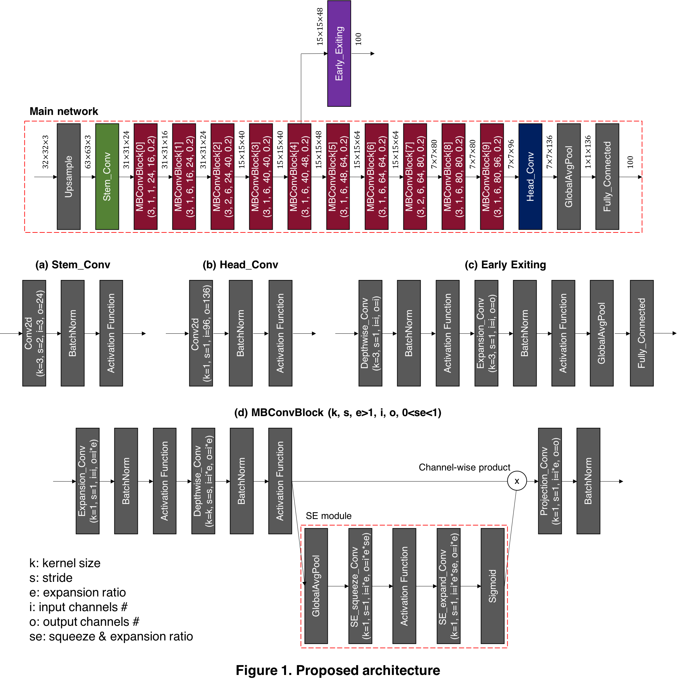
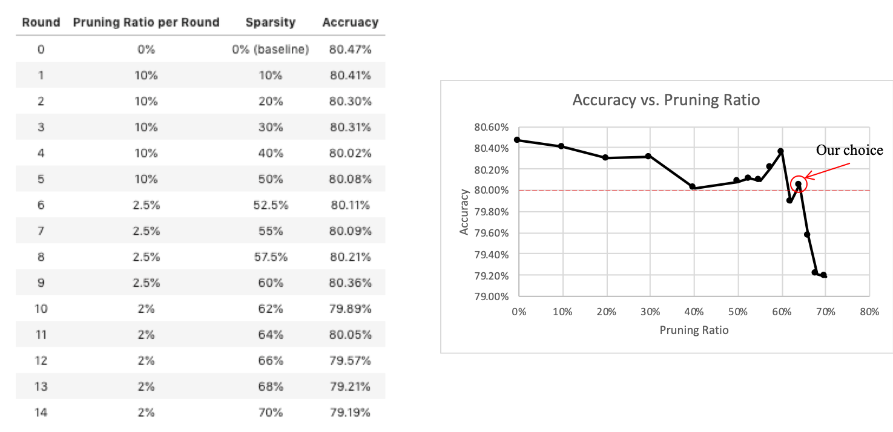
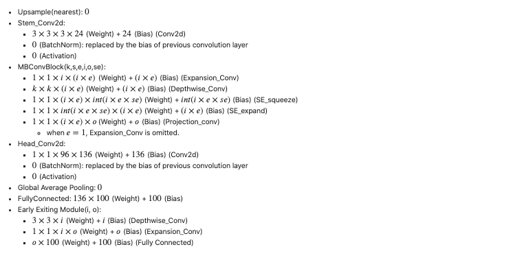
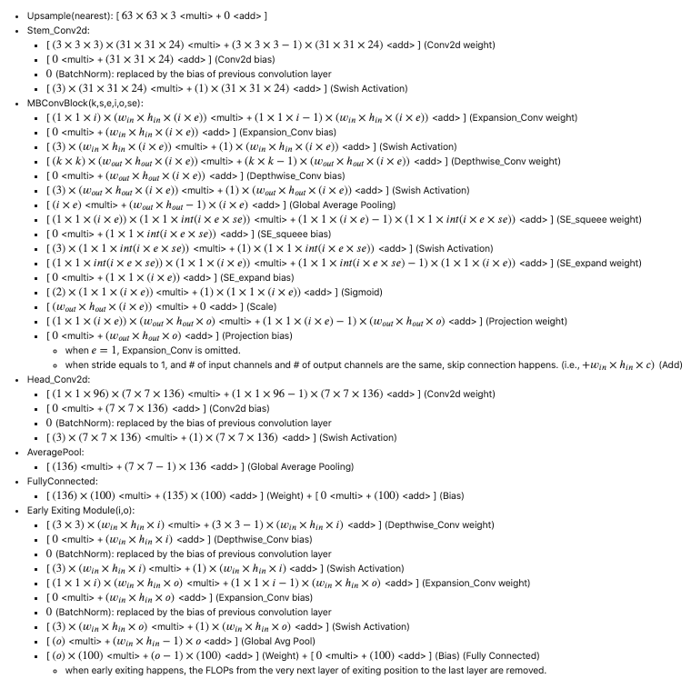

# MicroNet Challenge (Team: OSI AI)

Our team build a network having `80.03%` accuracy on cifar-100 with `0.003031` Parameter Storage score and `0.002753` Math Operations scroe, achieveing the MicroNet Challenge score of `0.005784`.

## 1. Overview
The below figure is our proposed architecture for the cifar-100 dataset. The numbers described above the arrows are the shape of each input and output.  
Our architecture consists of:  
<<<<<<< HEAD
1. Upsample Layer
2. Stem_Conv
3. 10 \* MobileNet V2 Convolution Block (MBConvBlock)
4. Head_Conv
5. Global Average Pooling
6. Fully Connected Layer  

The details of Stem_Conv, Head_Conv, and MBConvBlock are described below the 'Main network'.
=======
1. Main Network
    1. Upsample Layer
    2. Stem_Conv
    3. 10 * MobileNet V2 Convolution Block (MBConvBlock)
    4. Head_Conv
    5. Global Average Pooling
    6. Fully Connected Layer  
2. Early Exiting Module

The details of Stem_Conv, Head_Conv, MBConvBlock, and Early Exiting Module are described below the 'Main network'.
>>>>>>> develop
* In addition, in MBConvBlock\[0\], there is no the first three layers (Expansion_Conv, BatchNorm, Activation Function) in a block since there is no expansion when e=1.

## 2. Our Approach Detail

### 2-0. Configuration (Please refer to `Config/reproduce.json`)
* <b>Data & Model precision</b>
    * 16 bits
* <b>Data</b>
    * Dataset: cifar-100
    * Batch size: 128
    * Train size/Valid size: 50000/0
    * Augmentation: \[random crop 32*32 with padding of 4, random horizontal flip(p=0.5), normalization\] \+ (custom) auto augmentation for cifar-100 \+ Mixup
* <b>Model</b>
    * Architecture: See `figure 1`
    * Activation function: swish (beta=1)
    * Batch normalization: ghost batch normalization (splits=4)
    * Optimizer: sgd (lr=0.13, weight_decay=1e-5, momentum=0.9)
    * Loss function: cross entropy loss with label smoothing (smoothing factor=0.3)
    * Learning rate scheduler: cosine annealing scheduler (T_max=1200, without restart)
    * Epochs #: 1200
* <b>Pruning</b>
    * Pruning method(one shot/iterative): iterative
    * Desired sparsity/Pruning ratio per iteration: 64% / 10%\*5+2.5%\*4+2%\*2
    * Epochs # per pruning iteration: 600
    * Optimizer: sgd (lr=0.13, weight_decay=1e-5, momuntum=0.9)
    * Loss function: cross entropy loss with label smoothing (smoothing factor=0.3)
    * Learning rate scheduler: cosine annealing scheduler (T_max=600, without restart)
    * Weight reset: False
    * Normalization: Layer-wise magnitude normalization
* <b>Early Exiting</b>
    * Epochs #: 800
    * Optimizer: sgd (lr=0.13, weight_decay=1e-5, momuntum=0.9)
    * Loss function: soft smoothing loss
    * Learning rate scheduler: cosine annealing scheduler (T_max=800, without restart)
    * Augmentation: \[random crop 32*32 with padding of 4, random horizontal flip(p=0.5), normalization\]

### 2-1. Architecture Search
First of all, we search for a baseline architecture suitable for cifar-100 data set based on the [EfficientNet](https://arxiv.org/pdf/1905.11946.pdf) architecture using autoML. The search process is as follows:
1. <b>Block arguments search</b>: In this step, we search the number of MBConvBlock, and kernel size(k), stride(s), expansion ratio(e), input channels(i), output channels(o), and squeeze-expansion ratio(se) in each block. From the results of the block arguments search, we find out that the position of the convolutional layer which serves to reduce resolution, or convolutional layer with stride of 2, is a sensitive factor to accuracy. With this inference, after several hand-made experiments, the above architecture is chosen.

2. <b>Scaling coefficients search</b>: In this step, after block aurgments are decided, we search three coefficients by adjusting available resources: width, depth, and resolution. Actually, we set the depth coefficient as 1 since its slight change gets even worse in terms of score. Therefore, a resolution coefficient is set randomly within a given range according to the available resources, and then a width coefficient is calculated by \[available resources / resolution coefficient^2\].  From the results of the scaling coefficients search, we find out that a large resolution coefficient make a greater performance improvement than a large width coefficient under our circumstance. As a result, when we set available resources as 2, we get a resolution coefficient of 1.4. Finally, to lighten this model, we decide a width coefficient as 0.9, and adapt these coefficients to the model we've got via block arguments search.

### 2-2. Techniques for Improvement
* <b>[Auto augmentation](https://arxiv.org/pdf/1805.09501.pdf)</b>: We search 25 sub-policies for cifar-100 data set based on the augmentation search space in `AutoAugment` except `Cutout` and `SamplePairing`. Please refer to `AutoML_autoaug.py` for the process and `data_utils/autoaugment.py` for the policy we've got.
* <b>[Mixup](https://arxiv.org/pdf/1710.09412.pdf)</b>: We add a Mixup technique with alpha of 1, which is the hyperparameter for beta-distribution, after auto augmentation. We thought that this augmentation can help inter-exploration between arbitrary two classes.
* <b>[No bias decay](https://arxiv.org/pdf/1812.01187.pdf)</b>: We do not apply weight decay regularizer to biases. Since these part has a small percentage of the total, it can make underfitting.
<<<<<<< HEAD
* <b>[Swish activation function](https://arxiv.org/pdf/1710.05941.pdf)</b>: We use a <i>Swish</i> activation function with beta of 1, which is x \* sigmoid(x). This activation function is usually interpreted as a self-gate activation.
=======
* <b>[Swish activation function](https://arxiv.org/pdf/1710.05941.pdf)</b>: We use a <i>Swish</i> activation function with beta of 1, which is x * sigmoid(x). This activation function is usually interpreted as a self-gate activation.
>>>>>>> develop
* <b>[Ghost batch normalization](https://arxiv.org/pdf/1705.08741.pdf)</b>: We use ghost batch normalization, where batch is divided into four smaller ghost batch in our case to match the splited batch size to 32, instead of plain batch normalization.
* <b>[Label smoothing](https://arxiv.org/pdf/1512.00567.pdf)</b>: We use a label smoothing technique through which the probability of the correct label is assinged as 0.7, and 0.3/99 for the others.
* <b>[Cosine annealing scheduler](https://arxiv.org/pdf/1608.03983.pdf)</b>: We use cosine annealing scheduler for adaptive learning rate, and set a period of one cycle as the number of epochs. Hence, there is no restart process.

### 2-3. Pruning
After training the main network, we adapt layer-wise normalized magnitude-based iterative pruning method.  
We prune `64%` from whole weights in the following steps:  
1. 10% pruning * 5 times  
2. 2.5% pruning * 4 times
3. 2% pruning * 2 times

### 2-4. Early Exiting
Although general CNN models have the static computational graph for whole dataset, the desirable computational cost for each sample can differ.  
By exiting certain samples earlier, considerable FLOPs can be saved without significant accuracy degradation.  

To make this idea come true, we designed early exiting module in the following steps:
1. We selectd MBConvBlock\[2\] as the exiting position.
2. We added `early exiting module` at this position and trained it.
    * To ensure the performance of the main network to be preserved, <b>we freeze the pruned model and update the parameters of early exiting module only</b>.
    * <b>Data</b>
        * Same with the data configuration for the main network
        * Excpet not using (custom) auto augment & Mixup
    * <b>Model</b>
        * Same with the optimization configuration for the main network
        * Except not using label smoothing, epochs # is 800, and using <b>soft smoothing loss function\*</b>.
3. We introduce `threshold confidence` to decide when the samples exit. If the maximum probability for a certain class via early exiting module is greater than threshold confidence, the sample exit and do not go to the end of the main network.
4. We checked the trade-off by changing the exiting position.

\* <b>soft smoothing loss function</b>
- We propose a new loss function, a new confidence-aware loss function. Generally, the maximum softmax output value from the network is considered as confidence of the inference result. However, many papers pointed out that it shows over-confidence that outputs too large confidence values even for the uncertain samples.
- By conducting weighted average over loss of each sample using maximum softmax output, it gives large loss when the result has high confidence. The penalty given to the high confidence evades the situation that the network is over-confident in uncertain situation.
- So we multiplied (1 + max\_softmax\_output) value to cross entropy of each sample. Here, adding 1 makes the loss function act as monotonically increasing which ensures that learning direction is same with our intention.

The table below shows trade-off at each position when threshold confidence is 0.85, 0.88, and 0.9. (This results are obtained from 60% pruned model with varying early exiting positions.)

| Exiting Position | Exiting Path FLOPs\* | Added Param # | Early Exiting Ratio    |  Accuracy\**                    | Score                        |
| :---:            | :---:                | :---:         | :---:                  | :---:                           | :---:                        |
| MBConvBlock\[2\] | 25,512,831 (21.19%)  | 19,500        | 20.43%, 18.05%, 16.25% | 79.94%, 80.03%, 80.09% (55.81%) | 0.006371, 0.006437, 0.006487 |
| MBConvBlock\[3\] | 35,610,263 (29.58%)  | 19,500        | 22.92%, 20.24%, 18.33% | 80.26%, 80.35%, 80.38% (58.66%) | 0.006371, 0.006437, 0.006485 |
| MBConvBlock\[4\] | 47,043,295 (38.91%)  | 20,660        | 36.31%, 33.27%, 31.11% | 79.94%, 80.11%, 80.19% (64.62%) | 0.006208, 0.006274, 0.006321 |
| MBConvBlock\[5\] | 64,294,963 (52.72%)  | 22,980        | 50.42%, 47.05%, 44.92% | 79.96%, 80.00%, 80.14% (69.85%) | 0.006249, 0.006306, 0.006342 |

From the above result, we chose to use MBConvBlock\[4\] as the exiting position and applied to the final pruned main network. 

\* Exiting Path FLOPs(%) means that the number of math operations for the sample exiting in the middle. And, the percentage in parenthesis means `Exiting Path FLOPs / Total Path FLOPs`.
e.g.) If the exiting point is MBConvBlock\[2\],  
* Exiting Path FLOPs = From Upsample to MBConvBlock\[2\] FLOPs + Early Exiting FLOPs
* Total Path FLOPs = Main Network FLOPs + Early Exiting FLOPs  

\** The accuracy in parentheses is the accuracy with threshold confidence of 0.0. (i.e., all samples exit via the early exiting module.)

\* <b>Batchnorm Stablization Phenomena</b>  
When an early exiting module is trained, the main network is frozen but batchnrom buffers(running mean and running variance) in the main network are updated during early exiting module training.  
We observed the phenomena of increasing the accuracy of main network. We call this phenomena `batchnorm stablization`.

We conjecture that the training methods such as mixup affect input data to have different distribution with test data distribution.   
So updating batchnorm buffers by showing inputs without mixup seems to have stablizing effect on batchnorm buffers.  
This phenomena have reproduced in most of our experiment and it was not helpful at all when we didn't use mixup to the main network training.

## 3. Scoring metric
The table below describes the number of parameters and the number of operations of our model on a 32-bit basis, which is obtained by hand.  
Our score is calculated on 16-bit input, parameter, and 32-bit accumulator.
- Before pruning:
    - Parameter Storage (Score): 0.006449
    - Math Operation (Score): 0.008328
    - Therefore, score is 0.014777
- After pruning:
    - 64% pruning
    - Mask storage for pruning is included as 2-bits.
    - Parameter Storage (Score): 0.002748
    - Math Operation (Score): 0.003148
    - Therefore, score is 0.005896
- After Early Exiting:
    - Threshold confidence: 0.85
    - Early Exiting Ratio: 32.17%
    - Parameter Storage (Score): 0.003031
    - Math Operation (Score): 0.002753
    - Therefore, score is 0.005784

| 
Input
 | Operator         |  k  |  s  |  e  |  i  |  o  |  se  | Parameter Storage    | MULTI      |  ADD       | Math Operations |
| :---:                               | :---:            |:---:|:---:|:---:|:---:|:---:| :---:| :---:                | :---:      | :---:      | :---:           |
| 32\*32\*3                     | Upsample(nearest)| -   | -   | -   | -   | -   | -    | 0                    | 11,907     | 0          | 11,907          |
<<<<<<< HEAD
| 63\*63\*3                    | Stem\_Conv2d     | 3   | 2   | -   | 3   | 24  | -    | 648                  | 691,920    | 622,728    | 1,314,648       |
| 31\*31\*24                    | MBConvBlock\[0\] | 3   | 1   | 1   | 24  | 16  | 0.20 | 820                  | 669,132    | 584,484    | 1,253,616       |
| 31\*31\*16                    | MBConvBlock\[1\] | 3   | 1   | 6   | 16  | 24  | 0.20 | 5,379                | 5,167,209  | 4,590,315  | 9,757,524       |
| 31\*31\*24                 | MBConvBlock\[2\] | 3   | 2   | 6   | 24  | 40  | 0.20 | 11,812               | 5,455,164  | 4,933,372  | 10,388,536      |
| 15\*15\*40                 | MBConvBlock\[3\] | 3   | 1   | 6   | 40  | 40  | 0.20 | 25,448               | 5,188,584  | 4,908,848  | 10,097,432      |
| 15\*15\*40                   | MBConvBlock\[4\] | 3   | 1   | 6   | 40  | 48  | 0.20 | 27,368               | 5,620,584  | 5,285,048  | 10,905,632      |
| 15\*15\*48                   | MBConvBlock\[5\] | 3   | 1   | 6   | 48  | 64  | 0.20 | 40,329               | 8,300,475  | 7,896,393  | 16,196,868      |
| 15\*15\*64                   | MBConvBlock\[6\] | 3   | 1   | 6   | 64  | 64  | 0.20 | 62,220               | 12,452,004 | 12,004,428 | 24,456,432      |
| 15\*15\*64                     | MBConvBlock\[7\] | 3   | 2   | 6   | 64  | 80  | 0.20 | 68,364               | 7,549,092  | 7,228,348  | 14,777,440      |
| 7\*7\*80                    | MBConvBlock\[8\] | 3   | 1   | 6   | 80  | 80  | 0.20 | 96,976               | 4,156,368  | 4,033,376  | 8,189,744       |
| 7\*7\*80                     | MBConvBlock\[9\] | 3   | 1   | 6   | 80  | 96  | 0.20 | 104,456              | 4,532,688  | 4,385,392  | 8,918,080       |
| 7\*7\*96                   | Head\_Conv2d     | 1   | 1   | -   | 96  | 136 | -    | 13,056               | 659,736    | 639,744    | 1,299,480       |
| 7\*7\*136                    | AveragePool      | 7   | -   | -   | -   | -   | -    | 0                    | 136        | 6,528      | 6,664           |
| 136                              | FullyConnected   | -   | -   | -   | -   | -   | _    | 13,700               | 13,600     | 13,600     | 27,200          |
=======
| 63\*63\*3                     | Stem\_Conv2d     | 3   | 2   | -   | 3   | 24  | -    | 648                  | 691,920    | 622,728    | 1,314,648       |
| 31\*31\*24                    | MBConvBlock\[0\] | 3   | 1   | 1   | 24  | 16  | 0.20 | 820                  | 669,132    | 584,484    | 1,253,616       |
| 31\*31\*16                    | MBConvBlock\[1\] | 3   | 1   | 6   | 16  | 24  | 0.20 | 5,379                | 5,167,209  | 4,590,315  | 9,757,524       |
| 31\*31\*24                    | MBConvBlock\[2\] | 3   | 2   | 6   | 24  | 40  | 0.20 | 11,812               | 5,455,164  | 4,933,372  | 10,388,536      |
| 15\*15\*40                    | MBConvBlock\[3\] | 3   | 1   | 6   | 40  | 40  | 0.20 | 25,448               | 5,188,584  | 4,908,848  | 10,097,432      |
| 15\*15\*40                    | MBConvBlock\[4\] | 3   | 1   | 6   | 40  | 48  | 0.20 | 27,368               | 5,620,584  | 5,285,048  | 10,905,632      |
| 15\*15\*48                    | MBConvBlock\[5\] | 3   | 1   | 6   | 48  | 64  | 0.20 | 40,329               | 8,300,475  | 7,896,393  | 16,196,868      |
| 15\*15\*64                    | MBConvBlock\[6\] | 3   | 1   | 6   | 64  | 64  | 0.20 | 62,220               | 12,452,004 | 12,004,428 | 24,456,432      |
| 15\*15\*64                    | MBConvBlock\[7\] | 3   | 2   | 6   | 64  | 80  | 0.20 | 68,364               | 7,549,092  | 7,228,348  | 14,777,440      |
| 7\*7\*80                     | MBConvBlock\[8\] | 3   | 1   | 6   | 80  | 80  | 0.20 | 96,976               | 4,156,368  | 4,033,376  | 8,189,744       |
| 7\*7\*80                     | MBConvBlock\[9\] | 3   | 1   | 6   | 80  | 96  | 0.20 | 104,456              | 4,532,688  | 4,385,392  | 8,918,080       |
| 7\*7\*96                     | Head\_Conv2d     | 1   | 1   | -   | 96  | 136 | -    | 13,056               | 659,736    | 639,744    | 1,299,480       |
| 7\*7\*136                    | AveragePool      | 7   | -   | -   | -   | -   | -    | 0                    | 136        | 6,528      | 6,664           |
| 136                               | FullyConnected   | -   | -   | -   | -   | -   | _    | 13,700               | 13,600     | 13,600     | 27,200          |
>>>>>>> develop
| 100                               | -                | -   | -   | -   | -   | -   | -    | -                    | -          | -          | -               |
| Total                               | -                | -   | -   | -   | -   | -   | -    | 470,776              | 60,456,692 | 57,132,604 | 117,589,296     |

| 
Input
 | Operator         | Parameter Storage    | MULTI      |  ADD       | Math Operations |
| :---:                               | :---:            | :---:                | :---:      | :---:      | :---:           |
| 15\*15\*40                    | Early Exiting    | 20,660               | 1,717,436  | 1,596,564  | 3,314,000       |
| Total                               | -                | 491,436              | 62,174,128 | 58,729,168 | 120,903,296     |

### 3-1. Parameter Storage

### 3-2. Math Operations

## 4. Reproduce Process
* `python main.py ./Config/reproduce.json` # For reproducing
* `pthonn main.py ./Config/test.json` # For testing our final checkpoint
* You can access checkpoints for all steps at https://bit.ly/2pYSFYg
