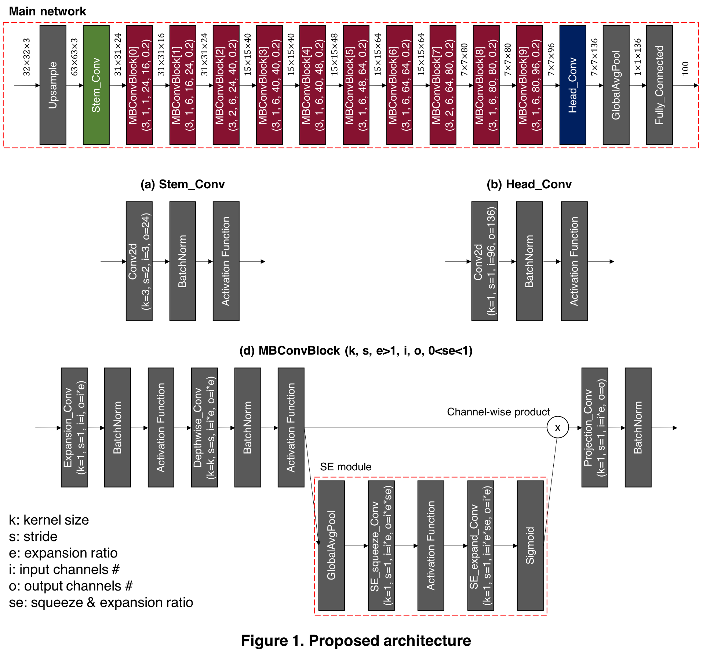

# MicroNet Challenge (Team: OSI AI)

Our team build a network having `80.06%` accuracy on cifar-100 with `0.5322(Mbyte)` parameters and `30.4957(FLOPs)` multiply-add operations, achieveing the MicroNet Challenge score of `0.006552`.

## 1. Overview
The below figure is our proposed architecture for the cifar-100 dataset. The numbers described above the arrows are the shape of each input and output.  
Our architecture consists of:  
1. Upsample Layer
2. Stem_Conv
3. 10 $\times$ MobileNet V2 Convolution Block (MBConvBlock)
4. Head_Conv
5. Global Average Pooling
6. Fully Connected Layer  

The details of Stem_Conv, Head_Conv, and MBConvBlock are described below the 'Main network'.
* In addition, in MBConvBlock\[0\], there is no the first three layers (Expansion_Conv, BatchNorm, Activation Function) in a block since there is no expansion when $e=1$.

## 2. Our Approach Detail

### 2-0. Configuration (Please refer to `Config/reproduce.json`)
* <b>Data & Model precision</b>
    * 16 bits
* <b>Data</b>
    * Dataset: cifar-100
    * Batch size: 128
    * Train size/Valid size: 50000/0
    * Augmentation: \[random crop 32*32 with padding of 4, random horizontal flip(p=0.5), normalization\] \+ (custom) auto augmentation for cifar-100 \+ Mixup
* <b>Model</b>
    * Architecture: See `figure 1`
    * Activation function: swish (beta=1)
    * Batch normalization: ghost batch normalization (splits=4)
    * Optimizer: sgd (lr=0.13, weight_decay=1e-5, momentum=0.9)
    * Loss function: cross entropy loss with label smoothing (smoothing factor=0.3)
    * Learning rate scheduler: cosine annealing scheduler (T_max=1200, without restart)
    * Epochs #: 1200
* <b>Pruning</b>
    * Pruning method(one shot/iterative): iterative
    * Desired sparsity/Pruning ratio per iteration: 50%/10%
    * Epochs # per pruning iteration: 600
    * Optimizer: sgd (lr=0.13, weight_decay=1e-5, momuntum=0.9)
    * Loss function: cross entropy loss with label smoothing (smoothing factor=0.3)
    * Learning rate scheduler: cosine annealing scheduler (T_max=600, without restart)
    * Weight reset: False
    * Normalization: Layer-wise magitude normalization

### 2-1. Architecture Search
First of all, we search for a baseline architecture suitable for cifar-100 data set based on the [EfficientNet](https://arxiv.org/pdf/1905.11946.pdf) architecture using autoML. The search process is as follows:
1. <b>Block arguments search</b>: In this step, we search the number of MBConvBlock, and kernel size(k), stride(s), expansion ratio(e), input channels(i), output channels(o), and squeeze-expansion ratio(se) in each block. From the results of the block arguments search, we find out that the position of the convolutional layer which serves to reduce resolution, or convolutional layer with stride of 2, is a sensitive factor to accuracy. With this inference, after several hand-made experiments, the above architecture is chosen.

2. <b>Scaling coefficients search</b>: In this step, after block aurgments are decided, we search three coefficients by adjusting available resources: width, depth, and resolution. Actually, we set the depth coefficient as 1 since its slight change gets even worse in terms of score. Therefore, a resolution coefficient is set randomly within a given range according to the available resources, and then a width coefficient is calculated by \[available resources / resolution coefficient$^2$\].  From the results of the scaling coefficients search, we find out that a large resolution coefficient make a greater performance improvement than a large width coefficient under our circumstance. As a result, when we set available resources as 2, we get a resolution coefficient of 1.4. Finally, to lighten this model, we decide a width coefficient as 0.9, and adapt these coefficients to the model we've got via block arguments search.

### 2-2. Techniques for Improvement
* <b>[Auto augmentation](https://arxiv.org/pdf/1805.09501.pdf)</b>: We search 25 sub-policies for cifar-100 data set based on the augmentation search space in `AutoAugment` except `Cutout` and `SamplePairing`. Please refer to `AutoML_autoaug.py` for the process and `data_utils/autoaugment.py` for the policy we've got.
* <b>[Mixup](https://arxiv.org/pdf/1710.09412.pdf)</b>: We add a Mixup technique with $\alpha$ of 1, which is the hyperparameter for beta-distribution, after auto augmentation. We thought that this augmentation can help inter-exploration between arbitrary two classes.
* <b>[No bias decay](https://arxiv.org/pdf/1812.01187.pdf)</b>: We do not apply weight decay regularizer to biases. Since these part has a small percentage of the total, it can make underfitting.
* <b>[Swish activation function](https://arxiv.org/pdf/1710.05941.pdf)</b>: We use a <i>Swish</i> activation function with $\beta$ of 1, which is $x\times sigmoid(x)$. This activation function is usually interpreted as a self-gate activation.
* <b>[Ghost batch normalization](https://arxiv.org/pdf/1705.08741.pdf)</b>: We use ghost batch normalization, where batch is divided into four smaller ghost batch in our case to match the splited batch size to 32, instead of plain batch normalization.
* <b>[Label smoothing](https://arxiv.org/pdf/1512.00567.pdf)</b>: We use a label smoothing technique through which the probability of the correct label is assinged as 0.7, and $\frac{0.3}{99}$ for the others.
* <b>[Cosine annealing scheduler](https://arxiv.org/pdf/1608.03983.pdf)</b>: We use cosine annealing scheduler for adaptive learning rate, and set a period of one cycle as the number of epochs. Hence, there is no restart process.

### 2-3. Pruning
After training the main network, we adapt layer-wise normalized magnitude-based iterative pruning method. We prune 10% from whole weights and repeat 5 times in the same way, and hence 50% of whole parameters are pruned.

## 3. Scoring metric
The table below describes the number of parameters and the number of operations of our model on a 32-bit basis, which is obtained by hand. 
- Before pruning:
    - Parameter Storage (Numbers): 0.47M / 36.5M * (1/2) = 0.006438
    - Math Operation (Numbers): 117.5M / 10490M * (1/2) = 0.005601
    - Therefore, score is 0.012039  
- After pruning:
    - 50% pruning
    - Parameter Storage (Numbers): 0.003645
    - Math Operation (Numbers): 0.002907
    - Therefore, score is 0.006552
    
Here, (1/2) means 16-bit quantization.

| 
Input
 | Operator         |  k  |  s  |  e  |  i  |  o  |  se  | Parameter Storage    | MULTI      |  ADD       | Math Operations |
| :---:                               | :---:            |:---:|:---:|:---:|:---:|:---:| :---:| :---:                | :---:      | :---:      | :---:           |
| $32^{2}\times3$                     | Upsample(nearest)| -   | -   | -   | -   | -   | -    | 0                    | 11,907     | 0          | 11,907          |
| $63^{2}\times3$                     | Stem\_Conv2d     | 3   | 2   | -   | 3   | 24  | -    | 648                  | 691,920    | 622,728    | 1,314,648       |
| $31^{2}\times24$                    | MBConvBlock\[0\] | 3   | 1   | 1   | 24  | 16  | 0.20 | 820                  | 669,132    | 584,484    | 1,253,616       |
| $31^{2}\times16$                    | MBConvBlock\[1\] | 3   | 1   | 6   | 16  | 24  | 0.20 | 5,379                | 5,167,209  | 4,590,315  | 9,757,524       |
| $31^{2}\times24$                    | MBConvBlock\[2\] | 3   | 2   | 6   | 24  | 40  | 0.20 | 11,812               | 5,455,164  | 4,933,372  | 10,388,536      |
| $15^{2}\times40$                    | MBConvBlock\[3\] | 3   | 1   | 6   | 40  | 40  | 0.20 | 25,448               | 5,188,584  | 4,908,848  | 10,097,432      |
| $15^{2}\times40$                    | MBConvBlock\[4\] | 3   | 1   | 6   | 40  | 48  | 0.20 | 27,368               | 5,620,584  | 5,285,048  | 10,905,632      |
| $15^{2}\times48$                    | MBConvBlock\[5\] | 3   | 1   | 6   | 48  | 64  | 0.20 | 40,329               | 8,300,475  | 7,896,393  | 16,196,868      |
| $15^{2}\times64$                    | MBConvBlock\[6\] | 3   | 1   | 6   | 64  | 64  | 0.20 | 62,220               | 12,452,004 | 12,004,428 | 24,456,432      |
| $15^{2}\times64$                    | MBConvBlock\[7\] | 3   | 2   | 6   | 64  | 80  | 0.20 | 68,364               | 7,549,092  | 7,228,348  | 14,777,440      |
| $7^{2}\times80$                     | MBConvBlock\[8\] | 3   | 1   | 6   | 80  | 80  | 0.20 | 96,976               | 4,156,368  | 4,033,376  | 8,189,744       |
| $7^{2}\times80$                     | MBConvBlock\[9\] | 3   | 1   | 6   | 80  | 96  | 0.20 | 104,456              | 4,532,688  | 4,385,392  | 8,918,080       |
| $7^{2}\times96$                     | Head\_Conv2d     | 1   | 1   | -   | 96  | 136 | -    | 13,056               | 659,736    | 639,744    | 1,299,480       |
| $7^{2}\times136$                    | AveragePool      | 7   | -   | -   | -   | -   | -    | 0                    | 136        | 6,528      | 6,664           |
| $136$                               | FullyConnected   | -   | -   | -   | -   | -   | _    | 13,700               | 13,600     | 13,600     | 27,200          |
| $100$                               | -                | -   | -   | -   | -   | -   | -    | -                    | -          | -          | -               |
| Total                               | -                | -   | -   | -   | -   | -   | -    | 470,776              | 60,456,692 | 57,132,604 | 117,589,296     |

### 3-1. Parameter Storage

### 3-2. Math Operations

## 4. Reproduce Process
* `python main.py ./Config/reproduce.json` # For reproducing
* `pthonn main.py ./Config/test.json` # For testing our final checkpoint
